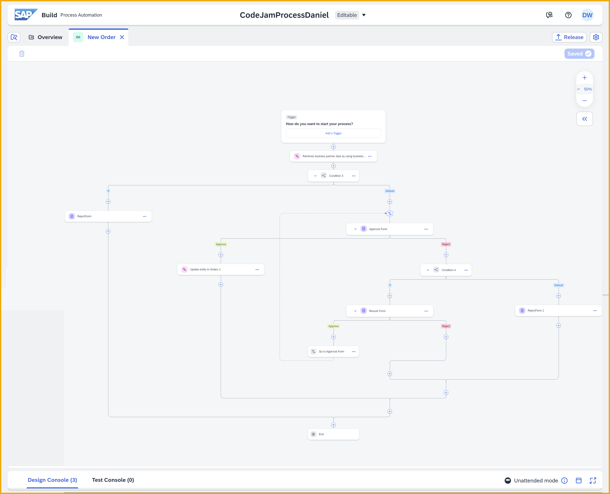

# CodeJam - With SAP Build, Create Apps, Processes, and Business Sites Without Coding

## Description

This repository contains the material for the **SAP Build CodeJam**, which is designed to get you started using SAP Build Apps and SAP Build Process Automation.

During the **SAP Build Codejam** you will build an app and a process, and the instructors will demo additional capabilities of SAP Build Process Automation (e.g., automation bots) and SAP Build Work Zone (e.g., business sites and embedding apps).

### What you will build

You will build a shopping cart app that lets a user browse a catalog of electronic equipment (take from the ABAP / ES5 demo product service), add items to their cart (maintained with a CAP service), and then request to purchase the items in the cart.

Then, you will create a process for approving the purchase. The process will make calls to S/4HANA (via SAP Business Accelerator Hub) and on approval update the CAP service maintaining the purchase request.

### The exercises

The SAP Build CodeJam exercises are written as a series of tutorials. You will likely not finish them all (we estimate around Tutorial 7). But we have provided additional exercises that you can do at home after the CodeJam that continues the experience and explains additional topics.

The tutorials are maintained in the tutorial mission: [SAP Build CodeJam](https://developers.sap.com/mission.build-codejam.html)

Here are links to the individual 

### Prerequisites

#### Hardware
If attending an in-person CodeJam, please bring your own laptop with power adapter.

#### Software
A supported Web browser such as Google Chrome, Firefox etc

#### Before Arriving
You should complete the prerequisites tutorial [Set Up Prerequisites for SAP Build CodeJam](https://developers.sap.com/tutorials/codejam-0-prerequisites.html), which:
* Sets up an SAP Business technology Platform trial account
* Sets up SAP Build Apps (and user in custom identity provider)
* Sets up SAP Build Process Automation
* Sets up a user for the ES5 demo system + destination to ES5 from SAP BTP

## How to obtain support

[Create an issue](https://github.com/SAP-samples/build-codejam/issues) in this repository if you find a bug or have questions about the content.

For additional support, [ask a question in SAP Community](https://answers.sap.com/questions/ask.html).

## Contributing

If you wish to contribute code, offer fixes or improvements, please send a pull request. Due to legal reasons, contributors will be asked to accept a DCO when they create the first pull request to this project. This happens in an automated fashion during the submission process. SAP uses [the standard DCO text of the Linux Foundation](https://developercertificate.org/).

## License

Copyright (c) 2022 SAP SE or an SAP affiliate company. All rights reserved. This project is licensed under the Apache Software License, version 2.0 except as noted otherwise in the [LICENSE](LICENSES/Apache-2.0.txt) file.
