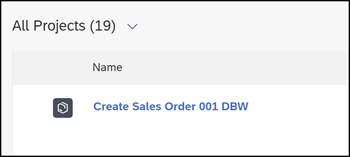
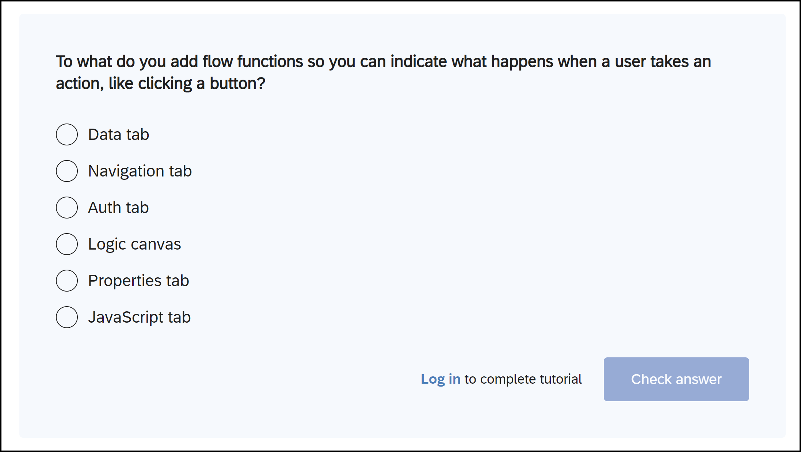
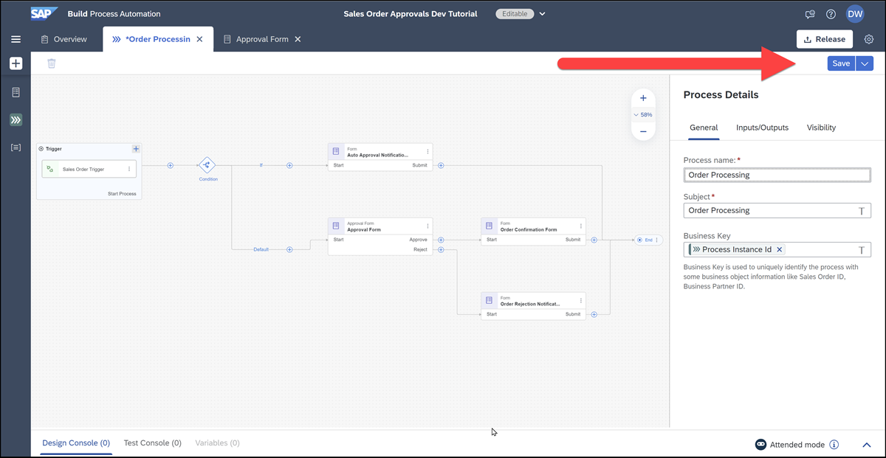
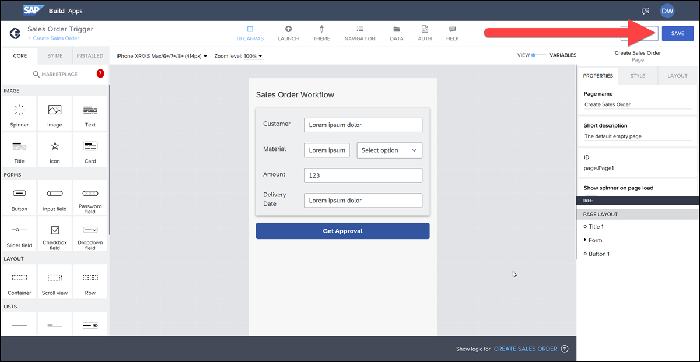
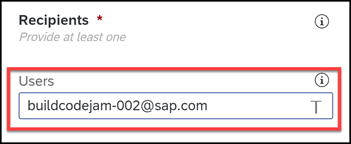
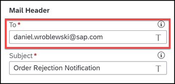
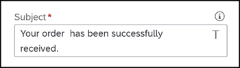

# Important Tips Before Starting

We were once newbies (not so long ago, in fact) and we went through what you are about to go through. So we wanted to give you a few tips – both basic guidance of how to navigate this Code Jam as well as a few lessons we learned along the way.

You might not remember all these tips, but just know if something doesn't work as expected, come back and see if these tips address it.

## General

- You will be given a user with a unique number, like 001. Name all your projects as well as your process with the number and with your initials, like:
  
    >Create Sales Order 001 DBW

    This will make it easier to find your work.

    

- DO NOT CREATE DESTINATIONS! These will be set up for you, as well as the mail server.

- Your SAP BTP sign-in has a tendency to time out. The tools have a mechanism to auto-save, but it's a good habit to save your work regularly – and certain things won't appear on one page if you haven't saved your work on another page.

- The Code Jam uses online tutorials designed for this Code Jam. At the end of each step, there are questions or simply a button to indicate you completed the step. You do not have answer the questions (though if you do you will receive a badge in the SAP Community 😺).

    

## SAP Build Process Automation

A few notes specifically for the SAP Build Process Automation part.

- The casing/spelling of fields is important (both when defining them in SAP Build Process Automation and when referencing them in SAP Build Apps). Be careful.
   
- Again, remember to save your work because until it gets saved other parts of the project will not get updated. You'll see.

    

    

- When entering emails for getting notifications in your SAP Build Inbox, use the email given to you for this course. 

    

    - However, for the one step for sending an ***email*** notification, use your personal email so you can check that it got delivered.

        

- Do not copy and paste into parameters fields for the different activities. Just type in the texts (don't worry, they are quite short).

    

- Sometimes not everything will appear in the **Monitor** tab if you have shields up, for example, in the Brave browser.

- If something is not working, there is a Design Console tab that will likely give you a reason and solution.

    

## Next

Now get started!

Continue to 👉 [Exercise 1.1 - Create Sales Order Business Process](/exercises/ex1-SAP-Build-Process-Automation/ex1.1/README.md)
