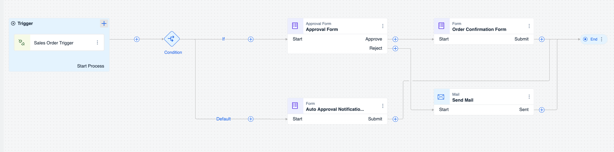

# Exercise 1.1 - Create Sales Order Business Process 

In this exercise, we use SAP Build Process Automation to create a simple process for approving a sales order.

The process receives the sales order details and then either:

- Automatically approves the sales order if it is below a certain threshold.
  
- Sends an approval form to the specified approver. Once the approver approves, the process ends. 

## Exercises

Perform all the steps in 👉 tutorial: 

- [Create Sales Order Business Process](https://developers.sap.com/tutorials/spa-academy-salesorder.html)

## Summary

You have now created a simple process in SAP Build Process Automation. Before building an app to trigger it, we want to test the process, in the next tutorial.

### Questions for Discussion

- Within a process, what types of steps can you create?

## Further Study

## Next

Continue to 👉 [Exercise 1.2 - Run the Sales Order Business Process](../ex1.2/README.md)
