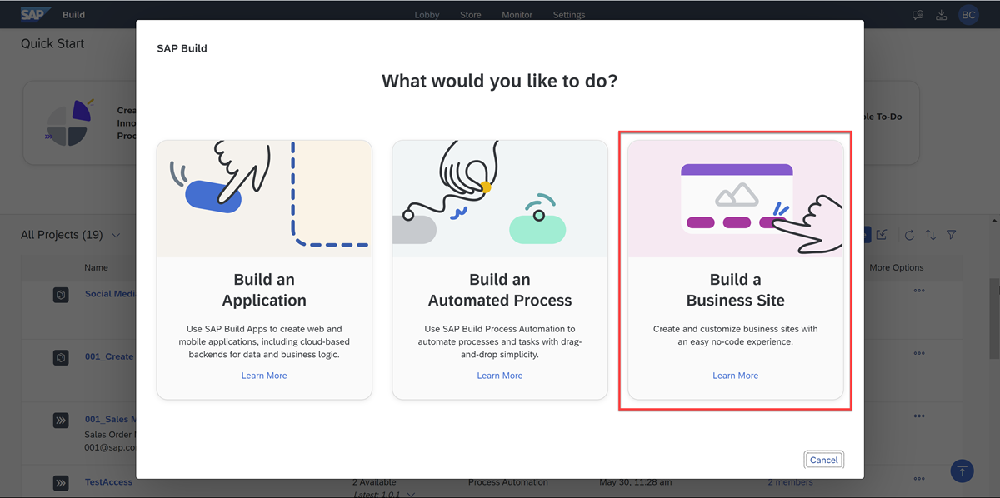
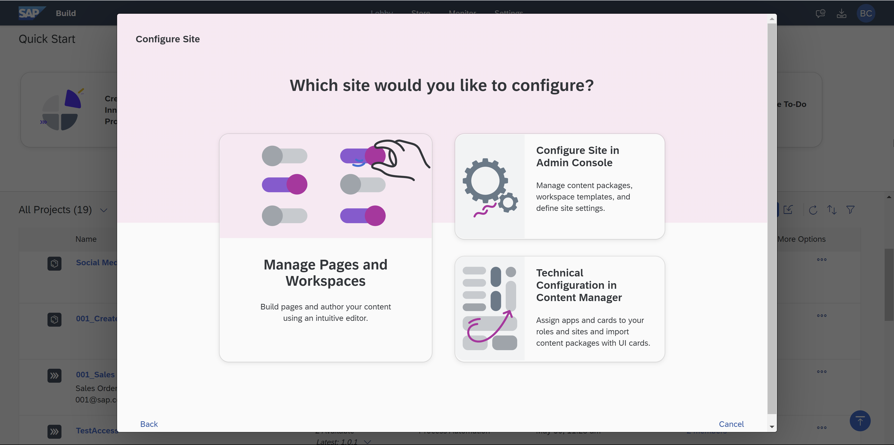
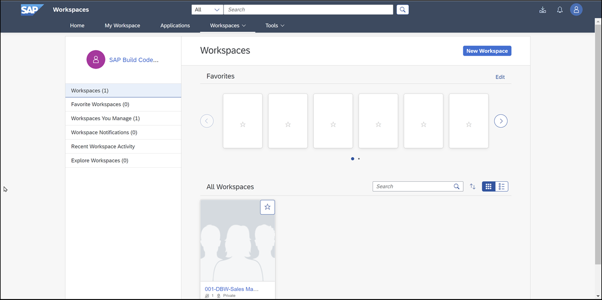

# Exercise 3.1 - Access SAP Build Work Zone and Add Workspace

In this exercise, you will start working with SAP Build Work Zone, and create a special workspace for your content.

## Exercises

First access the SAP Build Work Zone, advanced edition by going to the lobby and clicking **Create**

Click **Build a business site**.

Click **Manage Pages and Workspaces**.

This will open up SAP Build Work Zone.

Now perform all the steps in 👉 tutorial: 

- [Add a Workspace to SAP Build Work Zone](https://developers.sap.com/tutorials/workzone-build-2-workspace.html)

## Summary

You have now created a workspace in which you can add your apps and processes.

### Questions for Discussion

- Where can you deploy an SAP Build Apps project? Where would you want to?

- What different types of pages can you create?

- What different kinds of widgets can you add to a page?

## Further Study

- [What are SAP Work Zone Workspaces?](https://www.youtube.com/watch?v=IeW5kIgBiVs) (video)

- [Get Started with SAP Work Zone](https://www.youtube.com/watch?v=9wJyo6-GeTk) (video)

- [Explaining Personalized and Engaging Digital Experiences](https://learning.sap.com/learning-journey/compose-and-automate-with-sap-build-the-no-code-way/explaining-personalized-and-engaging-digital-experiences_bbbd9e69-4498-4086-ae24-d571f6e04300) (Learning Journey)

## Next

Continue to 👉 [Exercise 3.2 - Add a Web Dynpro ABAP App to Your SAP Build Work Zone](/exercises/ex3-SAP-Build-Work-Zone/ex3.2/README.md)
