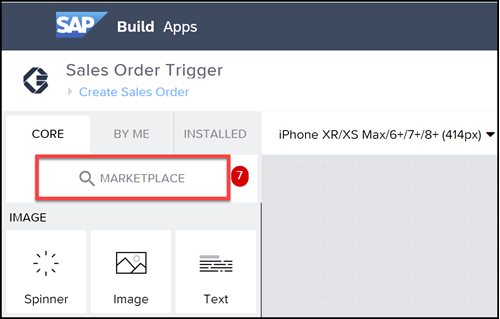
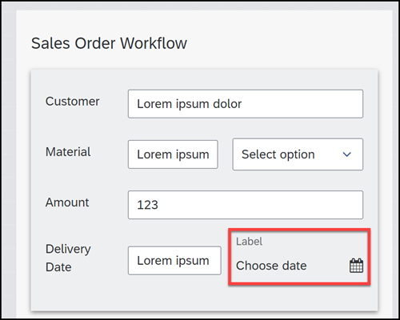
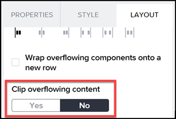
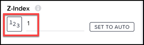

# Extra Credit: Date Field 

The formal exercises for the Code Jam are completed. But in case you want to continue to learn, we have provided a few addition challenges to extend what you've already done and to teach some important concepts or features.

In this exercise, you will upgrade the app you created to send sales order to your process, but add a date picker instead of requiring people to type in the date.

This will teach you about the Marketplace of more complex components and flow functions, and specifically about the **Date** field. 

## Exercise

For now, we won't give all the detailed instructions, but we will give you an outline of what you need to do.

1. Go to Marketplace and install the **Date field**.

    


2. Add a **Date field** next to the input field for the date.

    

3. Remove the **Label** text.

4. Configure the containers and **Date field** so the calendar will display.

    - In the 2 containers that contain the **Date field**, set the **Layout > Layout > Clip Overflowing Content** property to **No**.

        

    - In the 2 containers that contain the **Date field**, set the **Layout > Position > Z-Index** to **1**.

        

5. Bind the **Selected value** property to the following formula:

    ```JavaScript
    data["Trigger Workflow1"].salesorderdetails.expectedDeliveryDate
    ```


## Summary

You have now installed the Date field from the Marketplace, added it to your app, configured it so it appears properly, and configured it so the selected date will be sent to your sales order process.

## Next

We have additional learnings and extra credit tutorials 👉 [Additional learnings and tutorials](/exercises/extra-credit/README2.md)


