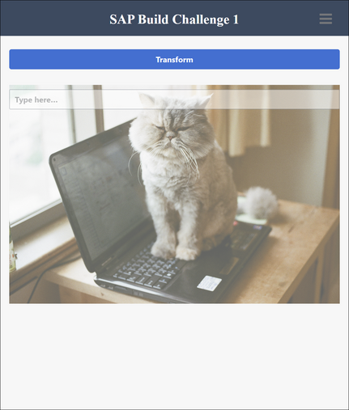
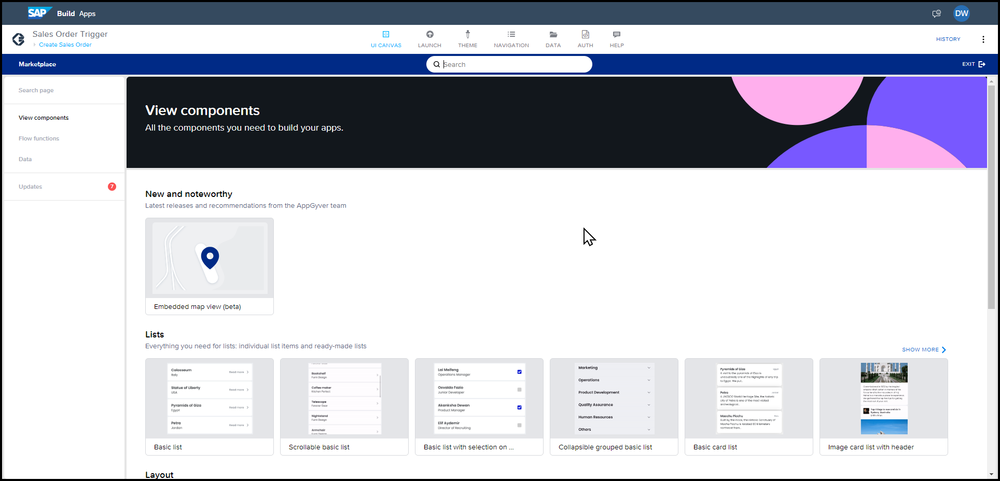
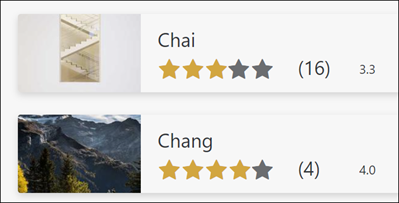

# Extra Credit: Additional Exercises (under construction)

If you are REALLY interested, below are some additional SAP Build Apps and SAP Build Process Automation tutorials we've selected for you.

## Exercises 

* [Manipulate data with formula](https://groups.community.sap.com/t5/sap-builders-discussions/sap-build-challenge-week-1-formulas/td-p/227990)  
    
    This challenge is taken from the recent SAP Build Community Challenge, where you are given some data and need to manipulate it with a formula.

    
    
    See a [reference](https://docs.appgyver.com/docs/formula-functions-reference) of all the formula functions.

    And see this [video](https://www.youtube.com/watch?v=ndJqYw4wMmc&t=226s) about working with formulas.

* [Explore the Marketplace of components](https://docs.appgyver.com/docs/marketplace)

    In addition to the basic components, SAP Build Apps provides a set of advanced UI components as well as logic flow functions within the Marketplace.  

    

* [Explore Visual Cloud Functions](https://developers.sap.com/mission.sap-build-apps-social-media.html)

    Do a mashup of business data with extended data stored in the new Visual Cloud Functions, a place for creating your own data models and server-side functions.
    
    

    Add "social media" functions to the business data by creating a rating system as well as a comment section.

    This tutorial will teach you about creating your own UI components, creating additional pages in your app, navigating between pages, using formulas to manipulate data, and advanced UI techniques.

* [Automation Bots](https://developers.sap.com/mission.intelligent-rpa-automations-get-started.html)

    Start learning to build automation bots with SAP Build Process Automation. Automate opening Excel worksheets and getting their information, then automatically opening web applications and entering data.
    

## Further Learning 

- [SAP Build Tutorials](https://developers.sap.com/tutorial-navigator.html?tag=software-product%3Atechnology-platform%2Fsap-build)
- [SAP Build Community Blog Posts](https://blogs.sap.com/tags/73555000100700001491/)
- [Daniel's Blog Posts](https://people.sap.com/daniel.wroblewski#content:blogposts)

