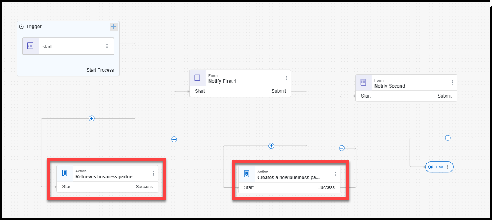
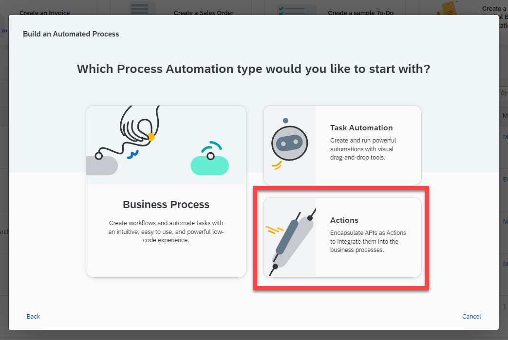
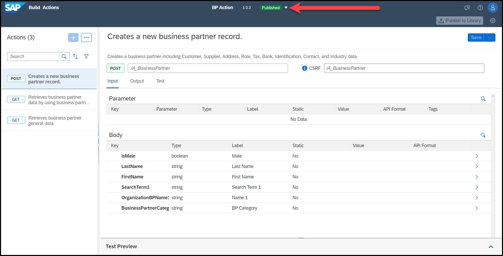
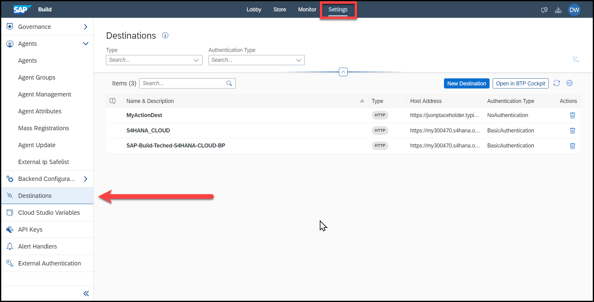

# Demo: Actions in SAP Build Process Automation

What can take a process to the next level is the ability to update external systems, including SPA systems like S/4HANA Cloud.

To update them, SAP Build Process Automation includes Action projects -- separate from a Business Process project. The Action project can establish connections with outside APIs, and it can be consumed in a regular Business Process project.

The magic here is that an IT admin can set up the actions, and then make them available to whoever he wants and to the projects he wants.

And the IT administrator also can choose which destinations to permit.

## Demo

The demo we will show does the following:

1. Get inputs via a form, including: a business partner to retrieve, and a few fields for creating a new business partner.

2. Retrieve the data for the business partner with the given ID.

3. Send notification form to user with info on business partner.

4. When form is submitted, create new business partner with the fields submitted.

5. Send notification form to user with the ID of the new business partner.
 

### Questions for Discussion

- What type of use cases could you imagine for using Actions within a process?

- As an IT administrator, how would you manage the actions you created and allowed others to use?

## Further Study

- [Connect Business Processes with External Systems in SAP Build Process Automation (tutorial)](https://developers.sap.com/group.connect-process-external-sap-bpa.html)

- [Create an Actions Project (documentation)](https://help.sap.com/docs/PROCESS_AUTOMATION/a331c4ef0a9d48a89c779fd449c022e7/609538e04bc843d887011765c14ecdda.html)

