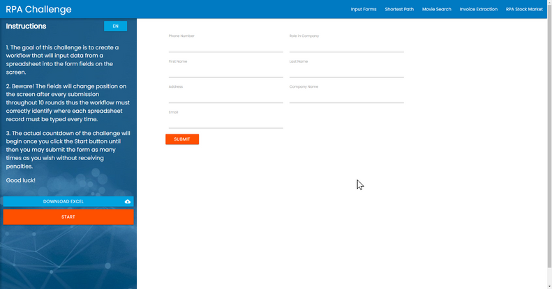
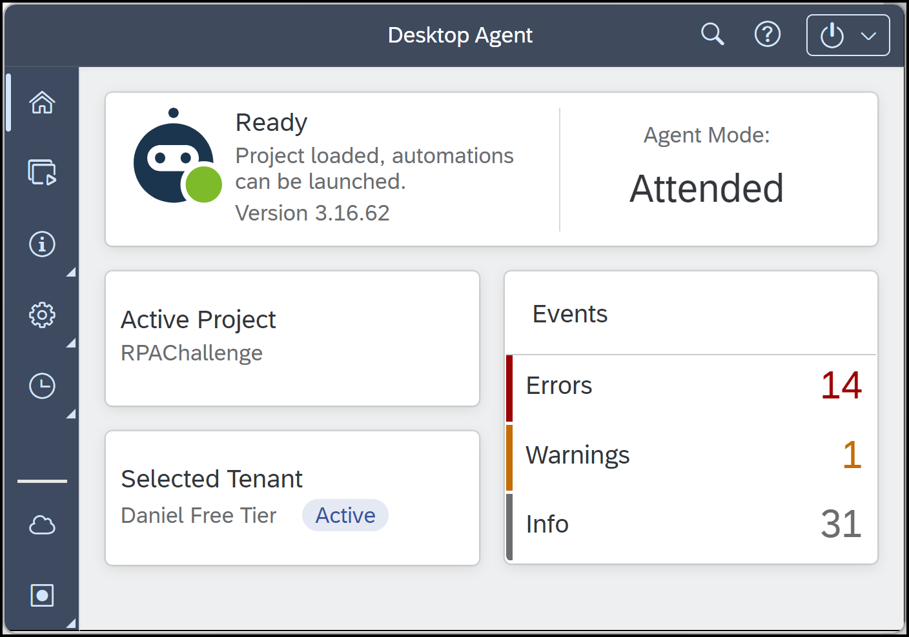
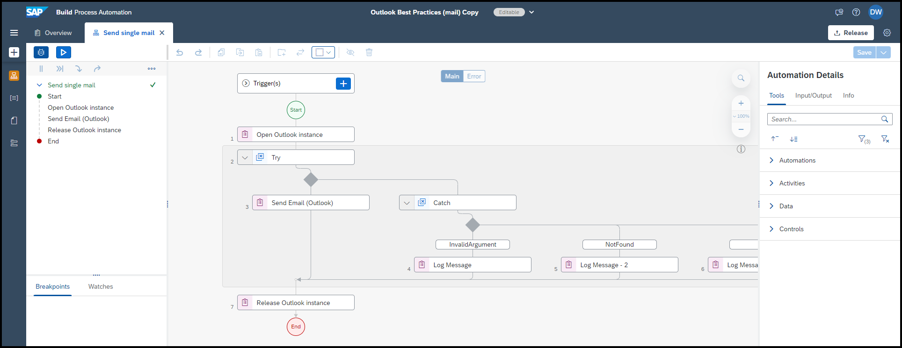

# Demo: Automation Bots in SAP Build Process Automation

SAP Build Process Automation is made up the ability to create processes and automation bots. You created a process, but this code jam does not include exercises for automation bots. So we would like to demo some of it for you.

# Demo #1

The first demo involves a simple automation where you control a web page. It is based on the recent RPA challenge from the SAP Build Community Challenge.

[RPA Challenge](https://groups.community.sap.com/t5/sap-builders-discussions/sap-build-challenge-week-3-automation-bots/m-p/254585)

The idea is that you automate the following:

1. Open Excel file.
2. Read rows of data, and place it into a custom data type.
3. Open web page.
4. Enter data, row by row, clicking **Submit** and other buttons after each.

The trick is that the fields change position, but they do retain certain CSS attributes so that you can find the correct fields.

In addition, we can make it so we do not have to enter SAP Build but instead create an attended trigger that lets us trigger the automation mnaully whenever we want from our desktop.

# Demo #2

The second demo involves simply opening Outlook and sending an email, but shows one of the many SDKs.

The magic here is that you can load the project from the Store, a set of hundreds of automations and processes. You can load a project, and then make small changes, mostly configuration, and it will work out of the box.

### Questions for Discussion

- What is the meaning of an SDK in SAP Build Process Automation, what are some of the key SDKs, and how do you install one?

- What types of use cases could you imagine for creating an automation bot on your desktop?

- What is an agent, and why is there such a concept -- that is, why would I need to "manage" the agents in an automation?
  
- What types of use cases could you imagine for creating an automation bot on a virtual machine?

## Further Study

- [Boost your Business Process with Automation, Decision and Process Visibility (tutorial)](https://developers.sap.com/mission.sap-process-automation-boost.html)

- [Explore How to Use MS Office Products with SAP Build Process Automation (tutorial)](https://developers.sap.com/group.spa-ms-office.html)

- [Automation Artifacts (documentation)](https://help.sap.com/docs/PROCESS_AUTOMATION/a331c4ef0a9d48a89c779fd449c022e7/67bb54f893f344fe81a2aa9554e162d9.html)

- [Create and Design Automations (documentation)](https://help.sap.com/docs/PROCESS_AUTOMATION/a331c4ef0a9d48a89c779fd449c022e7/468866bbe7014299907c9814c994f7b0.html)

